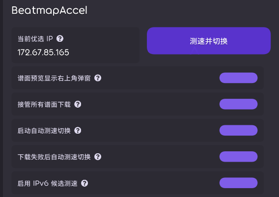

# BeatmapAccel

`BeatmapAccel` 是一个面向 `osu!lazer` 的谱面下载加速 ruleset。（Vibe Coding）

它的目标很明确：

- 为 `osu!lazer direct download` 选择当前更快的 Cloudflare IP
- 让下载尽量走优选 IP，而不是默认解析结果
- 在不修改 `osu!` 主工程的前提下，尽可能覆盖更多下载入口

项目当前提供两种工作方式：

- 预览弹窗模式：播放谱面预览后，在右上角弹出 BeatmapAccel 下载按钮
- 全局接管模式：尝试接管当前界面的谱面下载按钮、自动缺谱面下载和部分下载状态追踪




## 功能

- 内置 Cloudflare IP 测速器，可在预设 IPv4 段中选择更快的候选 IP
- 可选将 IPv6 段加入测速候选
- 支持手动填写当前优选 IP
- 支持手动点击 `测速并切换`
- 支持游戏启动后自动测速并切换
- 支持下载失败后自动重新测速并切换
- 支持预览后右上角下载弹窗
- 支持接管常见谱面下载按钮
- 支持尽量接管部分自动缺谱面下载场景

## 工作模式

### 1. 预览弹窗模式

这是默认启用的低风险模式。

行为是：

- 进入在线谱面列表或谱面详情页
- 播放谱面预览音频
- 右上角弹出 BeatmapAccel 下载按钮
- 点击后使用当前优选 IP 下载谱面

这个模式的优点是稳定、侵入性低，缺点是必须先触发预览。

### 2. 全局接管模式

这是默认关闭的高风险兼容模式。

行为是：

- BeatmapAccel 会尝试接管当前界面的谱面下载按钮
- 会尝试让部分自动缺谱面下载场景也走优选 IP
- 会尽量桥接原生下载状态，让按钮和进度显示看起来更接近原生下载链路

目前代码里已经覆盖或尝试覆盖的链路包括：

- 在线谱面详情页下载按钮
- 在线谱面列表卡片下载按钮
- 通用 `BeatmapDownloadButton`
- 谱面卡片 `Shift + 点击` 下载
- 本地谱面更新下载
- 部分多人 / 观战 / 每日挑战 / 缺谱面通知的自动下载

因为这是基于 ruleset 的运行时注入和反射接管，`osu!lazer` 更新后可能出现：

- 某些页面下载按钮失效
- 个别页面下载状态显示异常
- 少数自动下载链路漏接管

所以更适合愿意接受兼容风险的用户。

## 设置项说明

### 当前优选 IP

- 支持手动填写 IPv4 或 IPv6 地址
- 留空时会回退到默认域名解析
- 手动测速成功后会自动覆盖为测速结果中的最佳 IP

### 测速并切换

- 立即执行一次测速
- 会从当前候选 IP 中选择更快的一个
- 手动测速结果会同步更新到设置和提示文本

### 谱面预览显示右上角弹窗

- 默认开启
- 开启后，播放谱面预览时会在右上角显示 BeatmapAccel 下载弹窗
- 关闭后不会弹窗，但不影响全局接管模式单独启用

### 接管所有谱面下载

- 默认关闭
- 高风险兼容模式
- 开启后会尝试接管当前界面的谱面下载入口和部分自动下载链路

### 启动自动测速切换

- 默认开启
- 游戏启动后会在后台测速并更新优选 IP

### 下载失败后自动测速切换

- 默认开启
- 下载失败时会在后台重新测速
- 手动取消下载不会触发该逻辑

### 启用 IPv6 候选测速

- 默认关闭
- 你的网络具备稳定 IPv6 时再建议开启

## 使用说明

### 推荐用法

如果你更在意稳定性，建议：

1. 保持 `谱面预览显示右上角弹窗` 开启
2. 保持 `接管所有谱面下载` 关闭
3. 先点击一次 `测速并切换`
4. 需要下载时播放谱面预览，再点击右上角弹窗下载

### 进阶用法

如果你更在意方便性，想减少“必须先预览”的步骤，可以：

1. 开启 `接管所有谱面下载`
2. 先点击一次 `测速并切换`
3. 直接在在线谱面列表、谱面详情页或部分自动缺谱面场景中使用下载

### 手动指定 IP

适合以下情况：

- 你已经有自己测速得到的 Cloudflare IP
- 你只想固定使用某个 IP，不想让测速覆盖

如果你想固定某个 IP，可以关闭自动测速相关选项后手动填写。

## 已知限制

- 本项目不修改 `osu!` 主工程，而是通过 ruleset 注入实现
- 全局接管模式依赖反射和运行时 patch，兼容性天然弱于主工程改造
- 部分页面的下载状态显示可能和原生不完全一致
- 个别自动下载链路可能会因为 `osu!lazer` 更新而失效
- 如果你的网络对某个 Cloudflare IP 更差，手动填写错误 IP 可能导致下载更慢或失败

## 本地构建

```powershell
dotnet build .\osu.Game.Rulesets.BeatmapAccel\osu.Game.Rulesets.BeatmapAccel.csproj -c Release
```

## 输出文件

- `osu.Game.Rulesets.BeatmapAccel\bin\Release\net8.0\osu.Game.Rulesets.BeatmapAccel.dll`

## 安装

构建完成后，使用生成的 `dll` 安装到 `osu!lazer` 的 ruleset 目录即可。

如果你已经有自己的 ruleset 安装流程，按原流程放置这个 `dll` 就可以。

## 实现说明

项目当前主要由几部分组成：

- `CloudflareSpeedTestManager`
  - 负责测速、候选筛选和优选 IP 切换
- `PreviewTrackHandler`
  - 负责预览音频触发后的右上角弹窗
- `BeatmapAccelBeatmapModelDownloader`
  - 负责通过当前优选 IP 发起下载、导入谱面和失败恢复
- `GlobalBeatmapDownloadInterceptor`
  - 负责在全局接管模式下接管按钮、自动下载链路和部分状态桥接

## 说明

这个项目更偏实用型实验插件，不是对 `osu!lazer` 下载系统的官方替代实现。

谱面预览，弹出下载按钮参照了[LLin](https://github.com/MATRIX-feather/LLin)。

如果你只想要稳定可用的“下载加速”，建议优先使用预览弹窗模式。
如果你想覆盖更多下载入口，再考虑开启全局接管模式。
